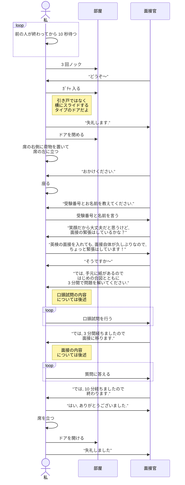

# 愛工大接続試験について

基本的に [昨年度](./2022.md) と変わっていなかったけど一応.  
どこが変わったとかはまあ見併せてね.

## 流れ

- 8:30 駅に到着
  - 巡回バスがあった
- 9:00 10 号館 1 階到着 (集合場所)
  - 高校の先生が名簿を持っていて, 専攻と名前を確認
  - 受験番号をもとに部屋が分かれるので, その案内を見る
  - 席は専攻ごとに, 受験番号順に縦方向に並んでいる感じ
- 9:25 (先生が黄色の台紙をいじいじ準備している)
  - 待機中はターゲットを見ていたり, 数学の教科書を見ていたり……
- 9:30 受験票の準備
  - 左半分の受験票をハガキから切り離すように言われる
  - また, 右半分の下側の注意事項も切り離すように言われる
  - 残った写真表の上に黄色い台紙から剥がした透明なカバーを張る  
     ちゃんと枠があって間違えることはないかと ^^
  - 順番に回収される  
    その後, アナログ単語帳のように, 受験番号順にリングにまとめられる
  - 注意事項が言われる
    - スマホ等の電子機器は電源を切ること
    - 私語厳禁
    - 不正行為, 疑わしい行為に気をつけて
- 9:45 各待機室へ移動
  - それぞれの待機室から各専攻ごとの待機室に移動
  - ここが意外と寒い～～～
- 9:50 待機室
  - コンシスとメディアは同じ待機室
  - ネックストラップがあるので, 自分の受験番号が書いてあるところに座る
  - 席は 5–6 人ずつ並んでいる感じ
    - 前から順番に 1, 2, 3, ... のように部屋番号が割り当てられる
    - 左から横方向に順番に面接が行われる
  - 私は 2 番目だったよ
- 10:00 面接スタート
  - 1 人目は即時スタート  
    面接の部屋は前の待機室から数階上の部屋
  - 面接の流れを説明される
  - その後, 2–3 人目は 1 人目に続けて面接の部屋の前へ
  - 待機室には戻らないので, 荷物ともども持っていく！
  - 私は 2 番目だったが, 待機室で待ってる人はどんな気持ちだったのであろうか
  - 面接の内容は後述
- 10:20? 面接終了
  - 3F でネックストラップを回収
  - 晴れて自由の身を実感すると共に、テストへの不安が押し寄せる (変化なし)
  - 池と 18 号館の間に先生と終わった人たちがいた (変化なし)
    - 寒い (迫真)
    - そこには喜怒哀楽があった
      ガチ凹んでいる人も談笑で楽しかった人も口頭試問ヤバいな人も……
      - “ここの部屋優しかったよ～”
      - “口頭試問何出た～？”
      - “えー！？ ここの部屋ハズレだった～”  
        など
  - 帰れ

## 面接の流れ

## 口頭試問の内容

- 口頭試問は CG, コンシスは共通
- 解ける問題から解いていく
  - “問 n hogefuga です” のように

### 数学

1. 連立方程式  
   頭の中でギリできない
1. $\log_{2}{((2 \times 5 - 6) \div 2)}$
1. $4x^3 - 3x^2 + 3$ の微分
1. $\theta = 60^\circ$ のとき, $\sin{\theta} + \cos{\theta}$ の値
1. サイコロを 2 回振って, 1 回だけ “6” が出る確率

### 英語

1. さっきまで覚えてたけど忘れた
1. 次の文に入るのに最も適切なものを選べ
   Please allow ＿＿＿＿＿ myself.
   - introduce to me
   - introduce me
   - me introduce
   - me to introduce
1. I have been to Australia three times. の和訳
1. 次に共通して当てはまる語句の原型を答えよ
   - Please ＿＿＿＿＿ quiet in the library.
   - 忘れた
1. 次の文に入るのに最も適切なものを答えよ  
   The soup ＿＿＿＿＿ warm. (まだそのスープは温かい)

## 面接

志望理由を聞かれて答えて, いくつか質問があって気づいたら 10 分経ってた.  
言いたいこと言えたし, 質問も答えられたので良かった. (何も覚えていない)

うちだけかもしれないけど:

- 情報系の質問 (HTTP とは？) などは予想に反して無かった
- 得意な教科や嫌いな教科, 勉強時間 など (部屋によってはあったらしい)
- 逆質問はあった

## その他

余韻に浸るのもつかの間, もうすぐテストだね.
